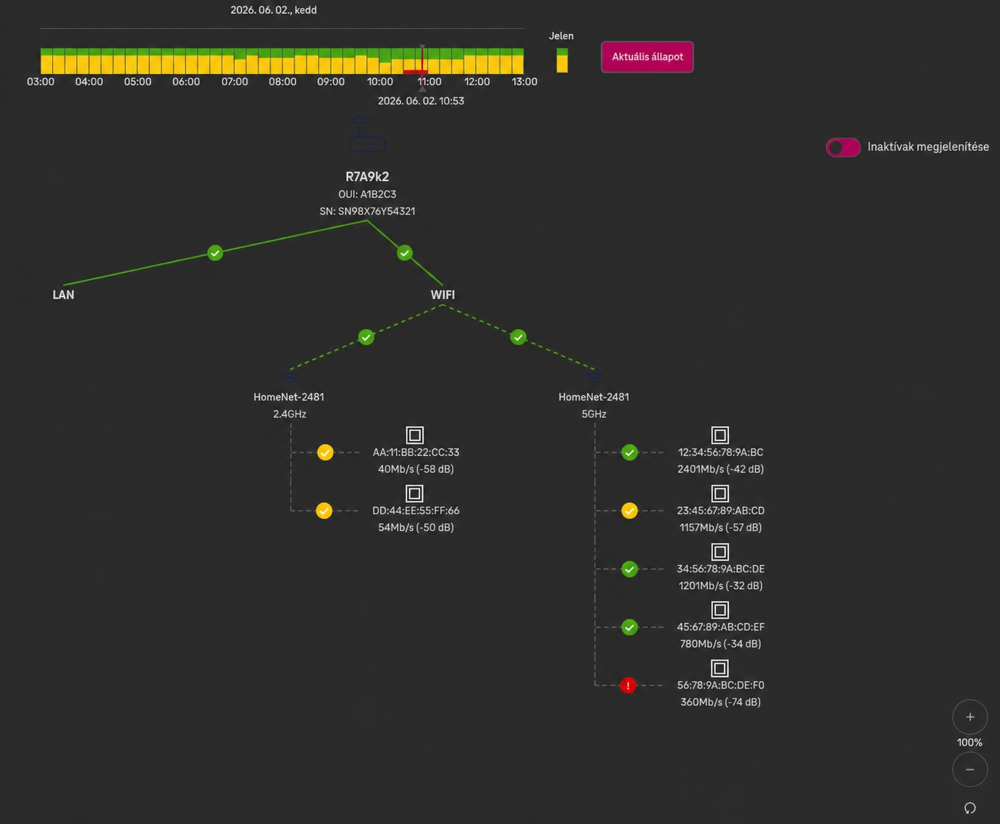
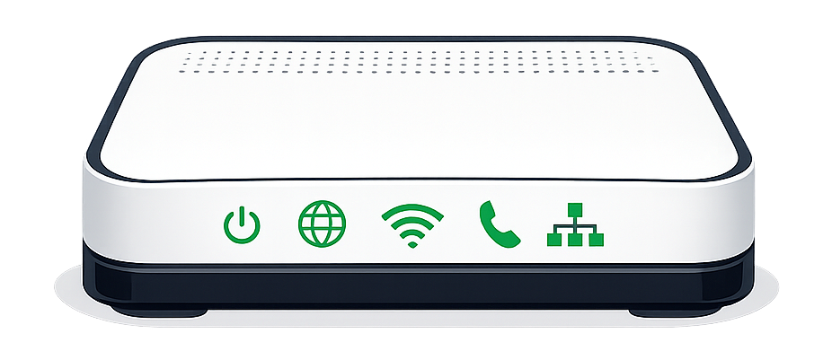
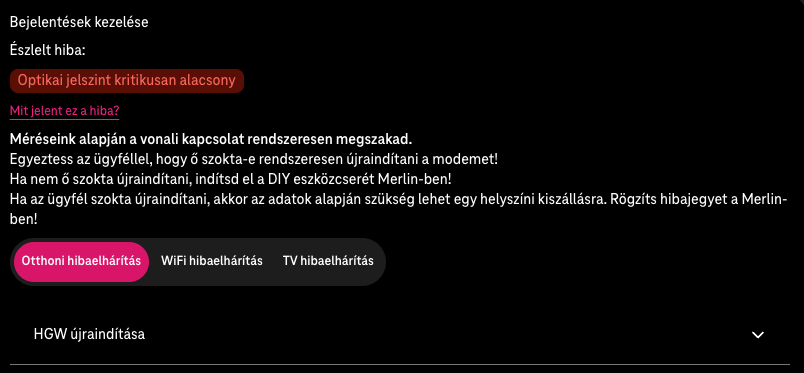
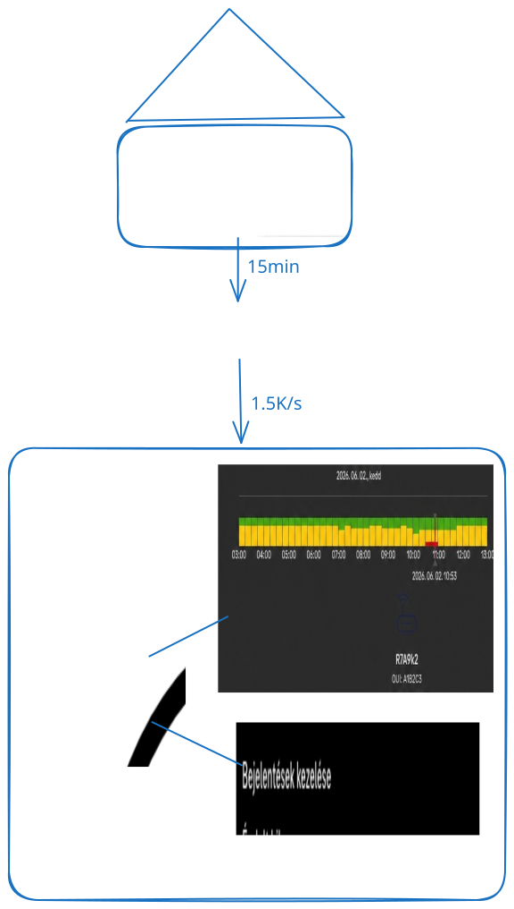

[← About Me](02-introduction.md) · [Index](00-index.md) · [Next →](04-whatisinthebox.md)

---

# Business Requirement

**The challenge:** aggregate telemetry from thousands of telecom home gateways — in near real-time.

**Constraints:**
- ~1,500–1,700 Kafka messages/sec
- Raw event retention: 10 hours
- Pattern detection window: 48 hours
- Infrastructure: 3 MongoDB nodes, no separate compute

  

The business needs to know: *Is this device experiencing low signal — and has it been like this for two days?*

---

[← About Me](02-introduction.md) · [Index](00-index.md) · [Next →](04-whatisinthebox.md)
