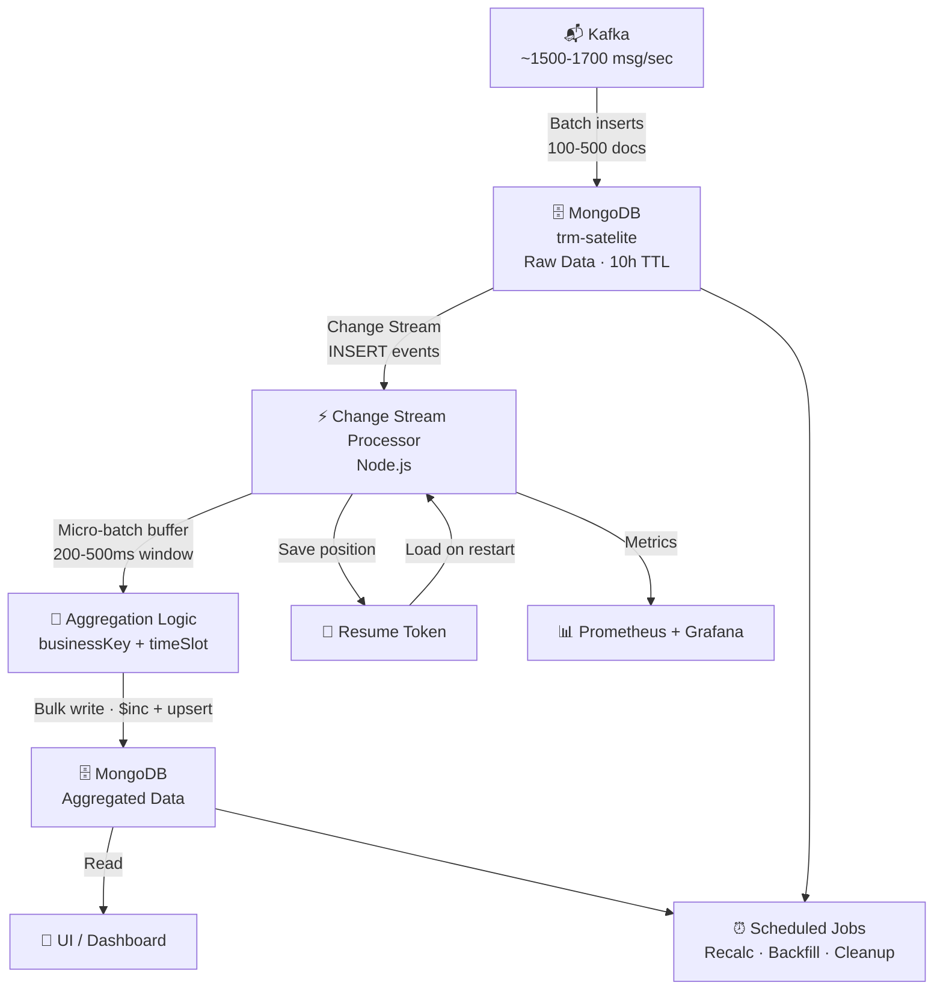

[← First Tries](04b-firsttry.md) · [Index](00-index.md) · [Next →](06-monitoring.md)

---

# Solution

**From pull to push: event-driven architecture.**

After two failed approaches (Spark, scheduled batch jobs), the breakthrough was switching from *polling* to *streaming*.

**Key decisions:**

| Decision | Why it matters |
|---|---|
| **Change Streams** | Events flow in real-time, no re-scanning |
| **Micro-batch (200–500ms)** | Reduces MongoDB round-trips 200–500× |
| **Resume token** | Crash-safe, no data loss on restart |
| **Single processor instance** | No distributed consensus needed |
| **Scheduled jobs** | Backfill, cleanup, and complex metric recalculation |

**Result:** 6,000+ msg/sec capacity · 1–2 sec end-to-end latency · 3–4× headroom

---

[← First Tries](04b-firsttry.md) · [Index](00-index.md) · [Next →](06-monitoring.md)
