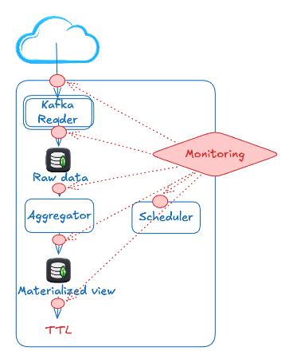
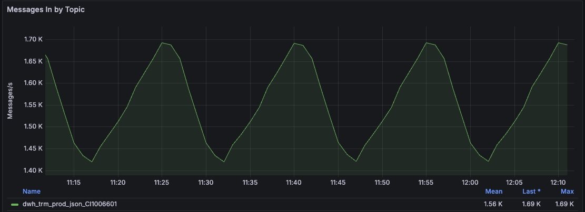
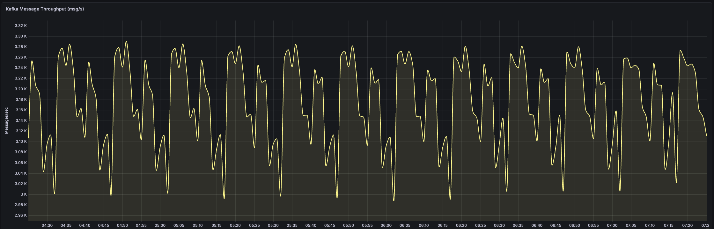
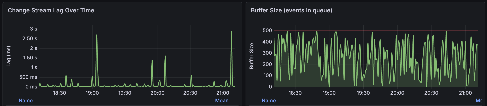
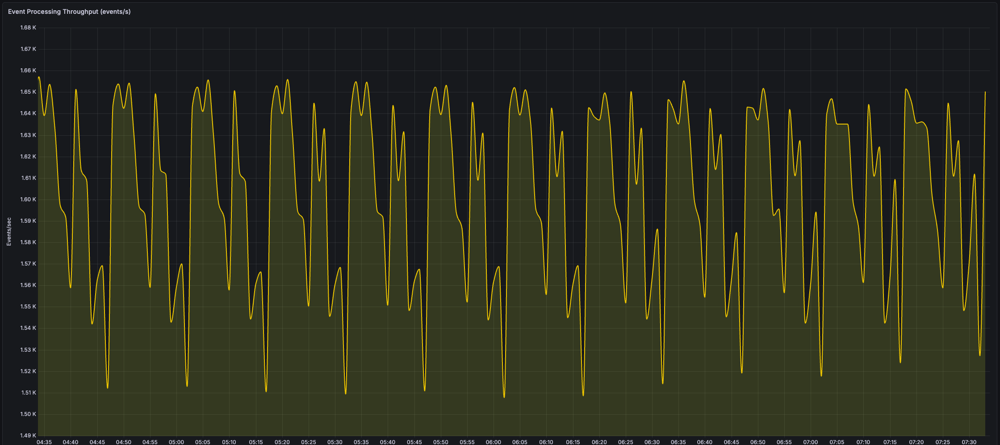
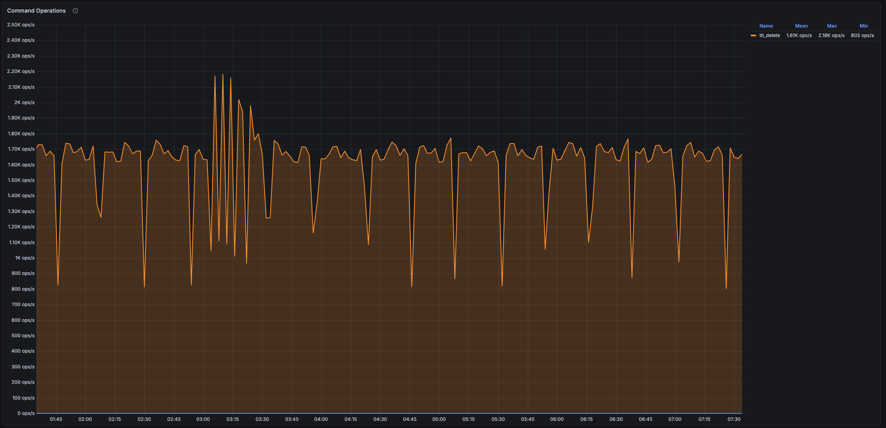
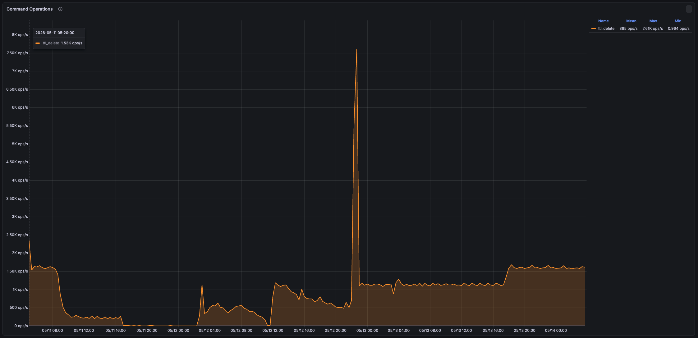

[← Solution](05-solution.md) · [Index](00-index.md) · [Next →](07-qa.md)

---

# Monitoring

**Visibility is not optional. It's the architecture.**

Without metrics, two hours to diagnose what should take two minutes.

> Every element of the pipeline needs its own monitoring and alerts.

---

### Kafka Reader — is data flowing in?

- **Messages/sec** — are we keeping up with the producer?
- **Kafka consumer lag** — how far behind are we from the latest offset?

---

### Change Stream Processor — is aggregation keeping up?

- **Change stream lag** — time between INSERT and aggregation write
- **Buffer size** — how full is the micro-batch window?
- **Bulk write latency** — is MongoDB keeping up with the flush rate?

---

### TTL — is raw data being cleaned up?

- **Collection size** — is it growing unboundedly?
- **TTL delete rate vs insert rate** — the gap that caused our crisis

**The lesson:** instrument first, scale later. A system you cannot observe is a system you cannot trust in production.

---

[← Solution](05-solution.md) · [Index](00-index.md) · [Next →](07-qa.md)
